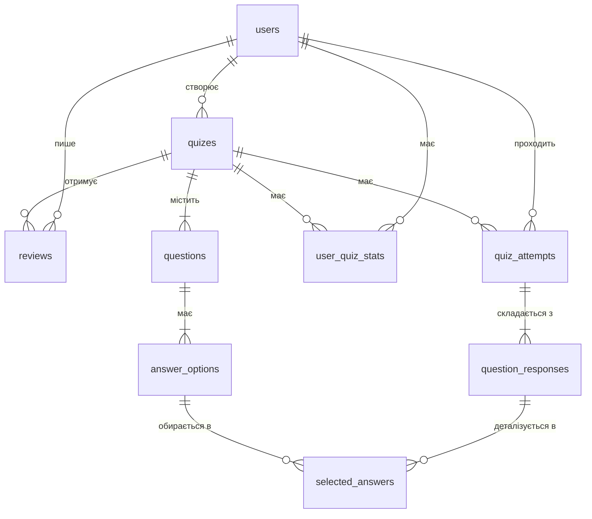

### Створення бази даних

Ця база даних розроблена для онлайн-платформи квізів. Вона дозволяє користувачам створювати тести, проходити їх, відстежувати свою успішність та залишати відгуки. Схема складається з 9 основних таблиць, які забезпечують цілісність та ефективність роботи з даними.

#### Діаграма схеми (ERD)

#### Опис таблиць, ключів та обмежень

1.  **users** - Зберігає дані про користувачів.

      * `user_id` (PK): Унікальний числовий ідентифікатор.
      * `username`, `email`: Текстові поля, які є унікальними (`UNIQUE`) для кожного користувача.

2.  **quizes** - Зберігає інформацію про тести (квізи).

      * `quiz_id` (PK): Унікальний ідентифікатор.
      * `author_id` (FK): Зовнішній ключ, що посилається на `users(user_id)`. **Припущення**: Квіз не може існувати без автора. **Обмеження**: При видаленні користувача всі його квізи також видаляються (`ON DELETE CASCADE`).

3.  **questions** - Зберігає питання, що належать до квізів.

      * `question_id` (PK): Унікальний ідентифікатор.
      * `quiz_id` (FK): Зовнішній ключ, що посилається на `quizes(quiz_id)`. **Обмеження**: Питання жорстко прив'язане до квізу і видаляється разом з ним.

4.  **answer\_options** - Зберігає варіанти відповідей до питань.

      * `answer_option_id` (PK): Унікальний ідентифікатор.
      * `question_id` (FK): Зовнішній ключ, що посилається на `questions(question_id)`. **Припущення**: Ця таблиця також зберігає правильні відповіді-ключі для питань типу `free_text`.

5.  **quiz\_attempts** - Детальний журнал кожної спроби проходження тесту.

      * `attempt_id` (PK): Унікальний ідентифікатор.
      * `user_id` (FK), `quiz_id` (FK): Зовнішні ключі, що посилаються на `users` та `quizes`. **Обмеження**: `score` зберігає вже обчислений фінальний бал для швидкості доступу та історичної точності.

6.  **question\_responses** - Фіксує відповідь користувача на одне питання в рамках однієї спроби.

      * `question_response_id` (PK): Унікальний ідентифікатор.
      * `attempt_id` (FK), `question_id` (FK): Зовнішні ключі, що зв'язують відповідь зі спробою та питанням.

7.  **selected\_answers** - Проміжна таблиця для фіксації обраних варіантів у питаннях типу `multiple_choice`.

      * `question_response_id` (PK, FK), `answer_option_id` (PK, FK): Композитний первинний ключ, що гарантує унікальність пари "відповідь-обраний варіант".

8.  **user\_quiz\_stats** - Агрегована таблиця для швидкого доступу до статистики успішності.

      * `user_id` (PK, FK), `quiz_id` (PK, FK): Композитний первинний ключ, що забезпечує один запис статистики на унікальну пару "користувач-квіз". **Припущення**: Поля `best_score`, `last_score` та `attempts` оновлюються логікою додатку після кожної завершеної спроби.

9.  **reviews** - Відгуки та рейтинги користувачів до квізів.

      * `review_id` (PK): Унікальний ідентифікатор.
      * `user_id` (FK), `quiz_id` (FK): Зовнішні ключі, що посилаються на автора відгуку та квіз. **Обмеження**: Поле `rating` приймає лише числові значення від 0 до 5 завдяки `CHECK`.

