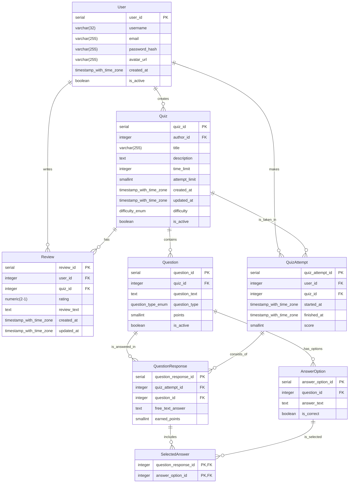

### Створення бази даних

Ця база даних розроблена для онлайн-платформи квізів. Вона дозволяє користувачам створювати тести, проходити їх, відстежувати свою успішність та залишати відгуки. Схема складається з 9 основних таблиць, які забезпечують цілісність та ефективність роботи з даними.

#### Діаграма схеми (ERD)

### Users

### Quizes

### Reviews

### Question

### Answer_Options

### Quiz_Attempts

### Questions_Responses

### Selected_Answers 

